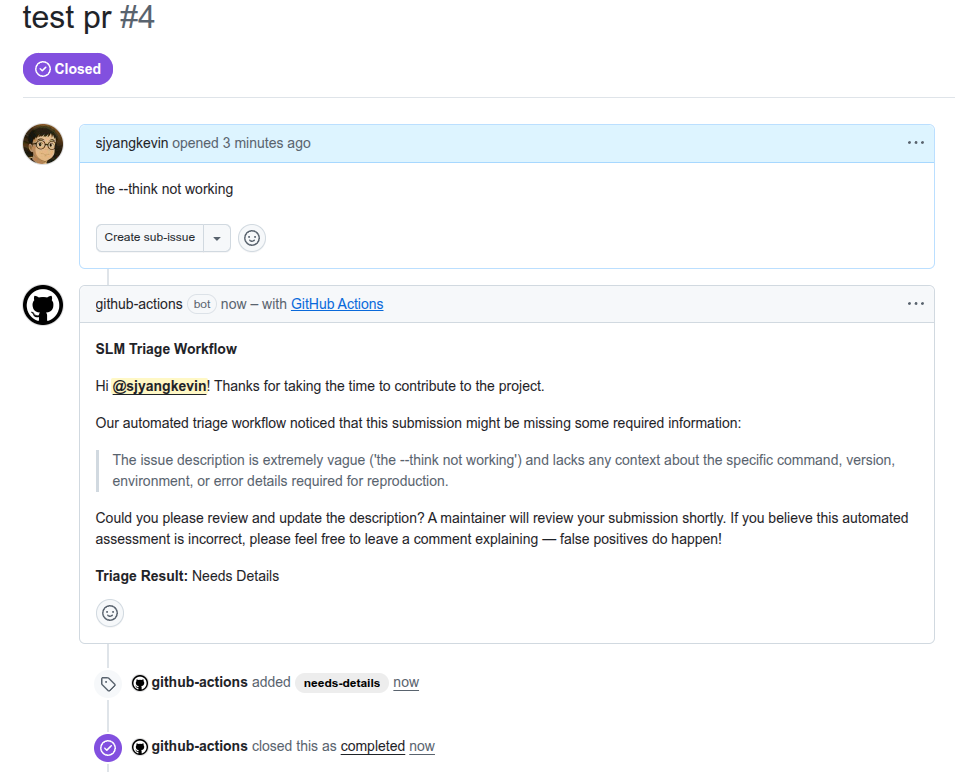

<div align="center">
  
</div>

# SLM Triage

[](https://github.com/sjyangkevin/slm-triage/actions/workflows/ci.yml)
[](https://codecov.io/gh/sjyangkevin/slm-triage)

A GitHub Action that runs a small language model (SLM) to triage incoming issues and pull requests, saving maintainers from the high volume of low-effort, low-signal contributions.

## The Problem

Open-source maintainers face an unsustainable burden from a growing flood of low-quality issues and pull requests. Generative AI tools have significantly lowered the barrier to entry, resulting in a surge of submissions that appear polished but often hallucinate APIs, ignore contribution guidelines, and lack actionable context.

This creates a [DDoS on human attention](https://www.reddit.com/r/opensource/comments/1q3f89b/open_source_is_being_ddosed_by_ai_slop_and_github/), draining maintainer's time and leading to burnout. While often referred to collectively as [AI-slop](https://github.com/ossf/wg-vulnerability-disclosures/issues/178), reliably defining or technically distinguishing between AI-generated contributions and human effort is difficult and highly subjective. The core issue is no longer about proving whether a submission was written by an AI, but rather about the **quality and actionable context** of the contribution itself.

## Why a Small Language Model?

Since technical "AI detection" could be challenging, an effective approach can be to evaluate the actual semantic quality of the contributions: does it provide the necessary context and make relevant changes.

GitHub Copilot, or cloud-hosted LLMs can also perform this evaluation, but they might introduce barriers for open-source triage:

| Barriers | LLM Services | SLM |
|---|---|---|
| **Cost** | Token-based API fees on every issue or PR | Free, runs on the GitHub runner |
| **Infrastructure** | Requires API keys and billing setup | Zero configuration beyond the action |

**SLM Triage** runs a Small Language Model directly on the GitHub Actions runner using [Ollama](https://ollama.com), to evaluate the quality of incoming issues and pull requests while staying well within the constraints of the standard free GitHub-hosted runner.

## Trade-offs

- **Runner time:** Local inference on CPU takes roughly 5 minutes per run. Model weights are cached between runs to avoid redundant downloads.
- **False positives:** SLMs can misinterpret nuance. The default behavior is to **label** and **comment** rather than close, keeping a human-in-the-loop for final decisions.
- **Context & Reasoning:** Small models may have limited reasoning capability over their context windows, and processing time can be long when analyzing very large pull requests or issues with extensive logs.

## Quick Start

Add this to `.github/workflows/slm-triage.yml` in your repository:

```yaml
name: SLM Triage

on:
  issues:
    types: [opened]
  pull_request:
    types: [opened]

jobs:
  triage:
    runs-on: ubuntu-24.04
    permissions:
      issues: write
      pull-requests: write
    steps:
      - name: Checkout
        uses: actions/checkout@v4

      - name: Run SLM Triage
        uses: sjyangkevin/slm-triage@v1
        with:
          github-token: ${{ secrets.GITHUB_TOKEN }}
```

## Inputs

| Input | Description | Default |
| --- | --- | --- |
| `github-token` | **Required.** GitHub token for API calls. |  |
| `ollama-model` | Ollama model for inference. | `qwen3.5:2b` |
| `ollama-think` | Enables reasoning tags for models that support it. | `false` |
| `actions`      | Comma-separated list of actions (`comment`,`label`,`close`). | `comment,label` |
| `review-label` | Label applied to submissions that need more info. | `needs-details` |

## How It Works

1. A new Issue or PR is opened in your repository.
2. The action installs Ollama and pulls a small language model (2 to 3 GB) on the runner. The model weight is cached between runs.
3. The model evaluates the submission's title, body, and optionally code changes, against a rubric to determine whether it contains actionable and relevant context.
4. If the submission is lacking (returning `Needs Details` by default), the action executes user-defined configuration hooks (like dropping a comment and applying a label).

## Local Testing

You can use the provided simulation script to test the triage logic locally against real, public GitHub issues or PRs without posting any automated replies:

```bash
# Basic test against an issue using the default model
uv run scripts/simulate_triage.py <owner>/<repo> <issue-number>

# Test using a specific model with reasoning/thinking enabled
uv run scripts/simulate_triage.py <owner>/<repo> <issue-number> --model qwen3.5:2b --think
```

*Note: If you run into strict rate limits, you can export `GITHUB_TOKEN` locally to authenticate the read-only fetch.*

## Examples

**Example Issue Triage Output**:

An example of an automated comment, label, and close actions issued by the SLM Triage workflow:

<div align="center">
  
</div>

## Configuration Examples

**Default Configuration**:
```yaml
- uses: sjyangkevin/slm-triage@v1
  with:
    github-token: ${{ secrets.GITHUB_TOKEN }}
```

**Aggressive Auto-Close Configuration**
```yaml
- uses: sjyangkevin/slm-triage@v1
  with:
    github-token: ${{ secrets.GITHUB_TOKEN }}
    ollama-model: "deepseek-r1:1.5b"
    ollama-think: "true"
    actions: "comment,label,close"
    review-label: "auto-spam"
```

## License

Apache License 2.0. See [LICENSE](LICENSE) for details.
